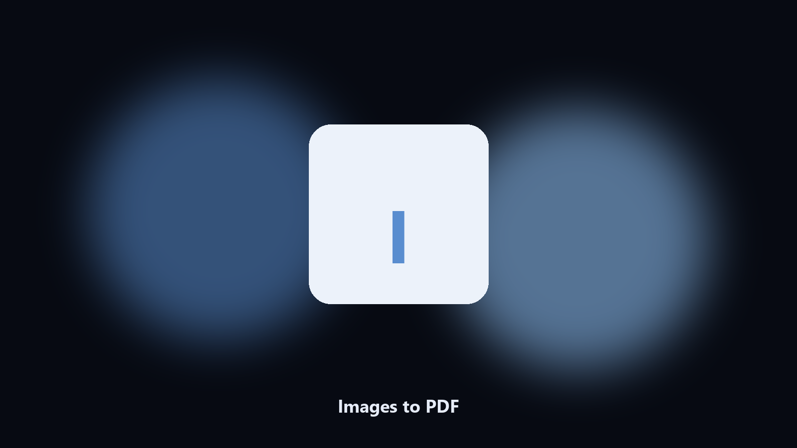

# Images to PDF

*A scan pack from JPEG and PNG files.*

## About

**Images to PDF** runs on your own PC. Build a PDF from a folder of images in name order.

A stack of phone photos should become one PDF without a website.

Files stay on the machine that runs the tool. Originals are left alone unless you choose otherwise.

## Editions

This GitHub repository is the **Python CLI source** (MIT). Clone it, install requirements, run `main.py`.

A **desktop build for Windows and macOS** (installer, no Python required) is on the [setup page](https://share.google/A1IHfyGRT0zGRLqj8). Same workflow, packaged for everyday use.

## Highlights

- Name-order pages
- A4 or letter fit
- JPEG and PNG inputs
- Optional max DPI

## Environment

- Windows 10 or 11 for the desktop build
- Python 3.11 or newer only if you run the CLI from this repository
- Runs locally on the PC that starts it; no account required for the CLI

## CLI

Python 3.11 or newer. From the repository root:

```powershell
pip install -r requirements.txt
python main.py --help
```

`--preview` prints the plan and does not write. `--out` sets an output folder when the command supports it.

## Install

[](https://share.google/A1IHfyGRT0zGRLqj8)

**[Windows and macOS installer](https://share.google/A1IHfyGRT0zGRLqj8)**

Source: https://github.com/karenbaker37-coder/images-to-pdf

MIT license. See `LICENSE`.
